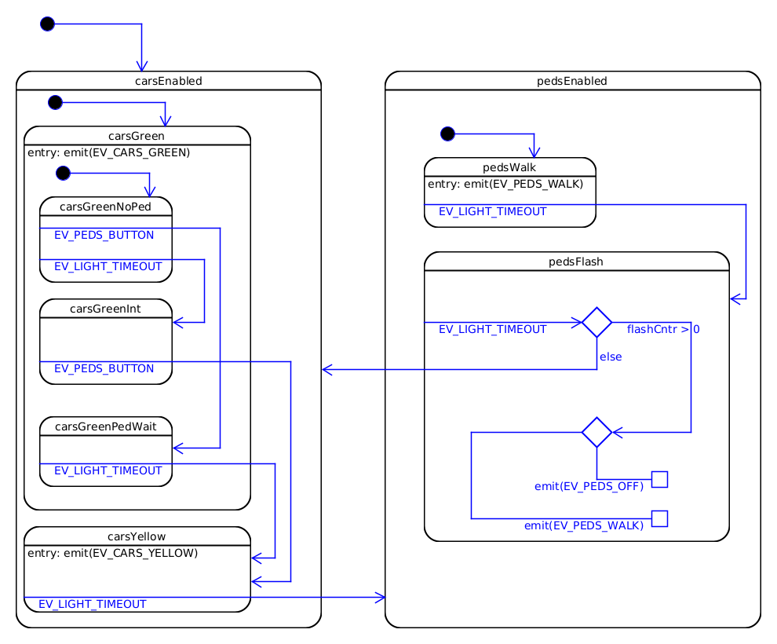
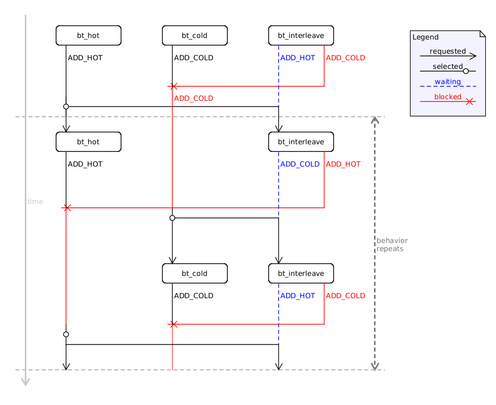

# Toy behavioral programming framework in C

## About

Toy [behavioral programming](https://www.wisdom.weizmann.ac.il/~bprogram/more.html) framework in C.
Uses [libdill](https://github.com/sustrik/libdill) for coroutines, channels and timings.
Individual b-threads are libdill's coroutines communicating with the main BP scheduler using
libdill's channels.

## A case study - **PE**destrian **LI**ght **CON**trolled crossing simulation

[pelican.c](src/pelican.c)

Traditionally the behavior of a [Pelican crossing](https://en.wikipedia.org/wiki/Pelican_crossing)
is presented by a hierarchical /state machine/statechart/:



It's not too complex, but understanding what actually happens for even this simple system
takes some time and effort. The main advantage of statechart formulation is that translating
to actual implementation is very simple, so simple in fact that it can be trivially automated.

In contrast the **behavioral programming** paradigm allows to specify the behavior of this
system in a more understandable way. The behavior is broken down to four scenarios, each
being a separate b-thread. Each animation shows an event trace with scenarios gradually being added:


#### 1. Lights cycle in specified order

```c
// the main behavior of the pelican crossing
// is cycling the lights in order
static void bt_cycle(bt_ctx_t *ctx)
{
    while (true)
    {
        bt_sync(ctx, EV_CARS_GREEN, 0, 0);
        bt_sync(ctx, EV_CARS_YELLOW, 0, 0);
        bt_sync(ctx, EV_PEDS_WALK, 0, 0);

        for (size_t i = 0; i < 3; i++)
        {
            // Flash pedestrian light
            bt_sync(ctx, EV_PEDS_OFF, 0, 0);
            bt_sync(ctx, EV_PEDS_WALK, 0, 0);
        }
        bt_sync(ctx, EV_PEDS_OFF, 0, 0);
    }
}
```

(Slowed down a little bit. The point is that the events change
sequentially with no variation in timing)


#### 2. There is a delay between light changes

```c
// the light changes are interspersed by time delays
static void bt_intersperse(bt_ctx_t *ctx)
{
    int64_t tmout;

    while (true)
    {
        // on EV_CARS_YELLOW, or EV_PEDS_WALK, or EV_PEDS_OFF
        ev_t ev = bt_sync(ctx, 0, EV_CARS_YELLOW | EV_PEDS_WALK | EV_PEDS_OFF, 0);
        if (ev == EV_CARS_YELLOW)
        {
            tmout = 3000;
        }
        else if (ev == EV_PEDS_OFF)
        {
            tmout = 500;
        }
        // start a timeout timer
        start_timer(EV_LIGHT_TIMEOUT, tmout);
        // wait for the timer event while blocking the successive events
        bt_sync(ctx, 0, EV_LIGHT_TIMEOUT, EV_PEDS_WALK | EV_PEDS_OFF | EV_CARS_GREEN);
    }
}
```

(Here we can see the proper timings between each phase.)


#### 3. The light changes are triggered by a waiting pedestrian

```c
// light cycling sequence is started by pressing the
// "pedestrian waiting" button and the next cycle can
// only start afte 'cars green' light
static void bt_trigger(bt_ctx_t *ctx)
{
    while (true)
    {
        bt_sync(ctx, 0, EV_PEDS_BUTTON, EV_CARS_YELLOW);
        bt_sync(ctx, 0, EV_CARS_GREEN, EV_PEDS_BUTTON);
    }
}
```

(The system waits indefinitely for a button press to start
the sequence)


#### 4. Make sure 'cars green' phase is long enough

```c
// makes sure cars have guaranteed minimal time
// of green light
static void bt_min_cars_green(bt_ctx_t *ctx)
{
    while (true)
    {
        // after 'cars green' block 'cars yellow'
        // for 5s
        bt_sync(ctx, 0, EV_CARS_GREEN, 0);
        start_timer(EV_LIGHT_TIMEOUT, 5000);
        bt_sync(ctx, 0, EV_LIGHT_TIMEOUT, EV_CARS_YELLOW);
    }
}

```

(Another timeout event is added initially to delay the effect
of the button press)


We can see how gradually adding b-threads refines the behavior.
Each scenario contains the "essence" of some function of the system and
is much closer to a description humans use to teach and to explain things to
each other. B-threads are essentially executable and composable scenarios/stories.

In the /state machine/statechart/ approach there is a gap between the
requirements/specification and statechart formulation. In behavioral programming
there is no gap. The implementation is as close as possible to behavior specification.

## Water-taps application

[waterflow.c](src/waterflow.c)
The simplest application discussed in literature in context of **BP**.
Visualized in an informal diagram:



## Tic-tac-toe

[tictactoe.c](src/tictactoe.c)

The classic paper-and-pencil game. Implemented using 53 b-threads.

## Warnings and to-dos

 - [ ] the execution semantics were based on natural language descriptions of the paradigm,
       not on any formal description, so the scheduler might need some more work
 - [ ] event sets are just simple 32-bit flags. Proper abstract sets are needed for full
       functionality
